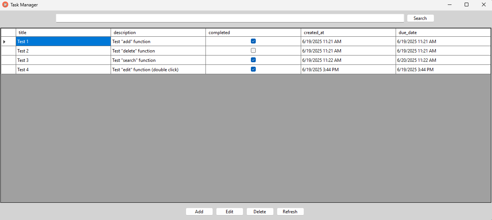
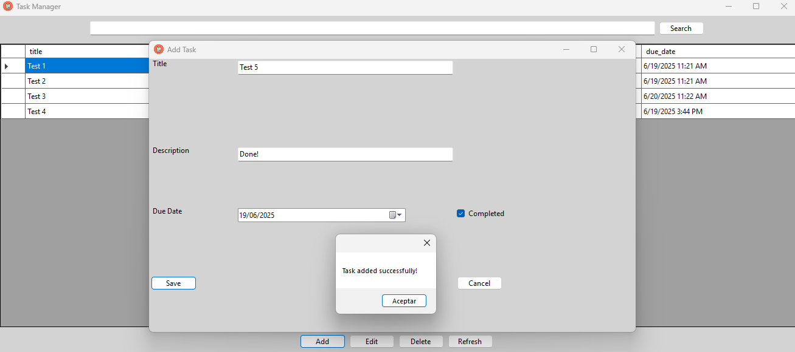
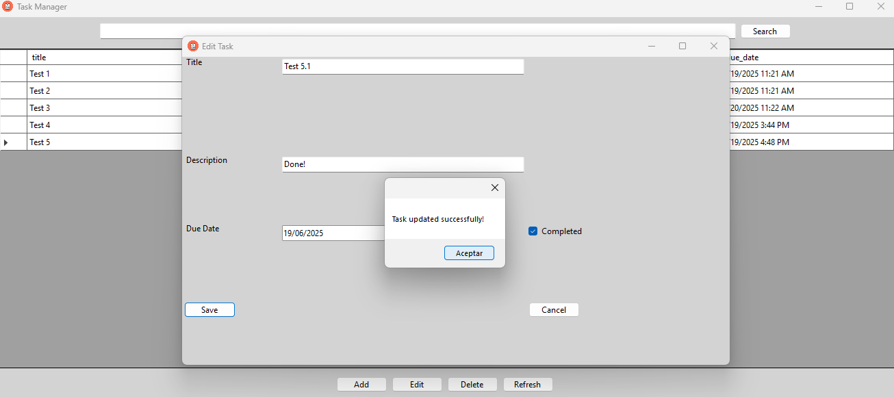

# 🗂️ TaskManager – Desktop Task Organizer (C# + WinForms)

**TaskManager** is a lightweight desktop app for managing tasks locally. It lets you create, edit, search, and delete tasks efficiently — all without needing internet or cloud accounts. Built in **C# with Windows Forms** and powered by **SQLite**, it’s simple, fast, and fully offline.

This project was developed as part of my personal portfolio to sharpen my C# and WinForms skills and explore desktop deployment and resource embedding.

---

## 🔧 Features

- ✅ Add, edit, delete tasks
- 🔍 Search tasks in real-time
- 📋 Copy task data from the table (via right-click or Ctrl+C)
- 🗃️ All data stored in a local SQLite database (embedded)
- 📦 Fully self-contained executable (no install needed)
- 🌐 Interface language: English (UI labels, buttons, and messages). System dialogs like "Yes/No" may still appear in the local OS language — this is expected behavior.    
- 🖼️ Custom application icon and clean UI
- 💾 Persistence across sessions

---

## 🚀 Technologies Used

- C# (.NET 8.0)
- Windows Forms (WinForms)
- SQLite (local database, embedded into the executable)
- Visual Studio 2022
- Resource embedding for single `.exe` deployment

---

## 🖥️ How to Use

1. Download the `.exe` from the [Releases](https://github.com/yourusername/TaskManager/releases) section.
2. Double-click to run it. No installation required.
3. Use the interface to manage your tasks — your data is saved locally.

⚠️ Your system needs to support **.NET 8 Runtime**. If the app doesn’t start, make sure you have [this installed](https://dotnet.microsoft.com/en-us/download/dotnet/8.0/runtime).

---

## 📁 Project Structure

├── Program.cs # Entry point
├── MainForm.cs # Main UI for task listing/searching
├── AddTaskForm.cs # Modal form to add tasks
├── DbManager.cs # Manages embedded SQLite DB extraction and connection
├── README.md # This file

---
## 🖼️ Screenshots
Main task management window:

Task adding form:

Task editing form:

---

## 🔓 License

This project is released under the MIT License. Do what you want with it — just don't sell it as-is under your name 😉.

---

## 📬 Contact

If you like this project or want to collaborate, feel free to reach out!

> 👨‍💻 Andrei Valentin Ronai – [andrei.v.ronai@gmail.com]  
> 🌐 Portfolio [https://rva-projects.github.io/portfolio/]  
> 🐙 [github.com/RVA-Projects]
